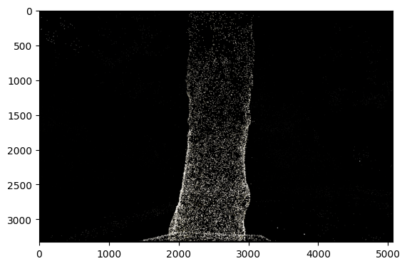
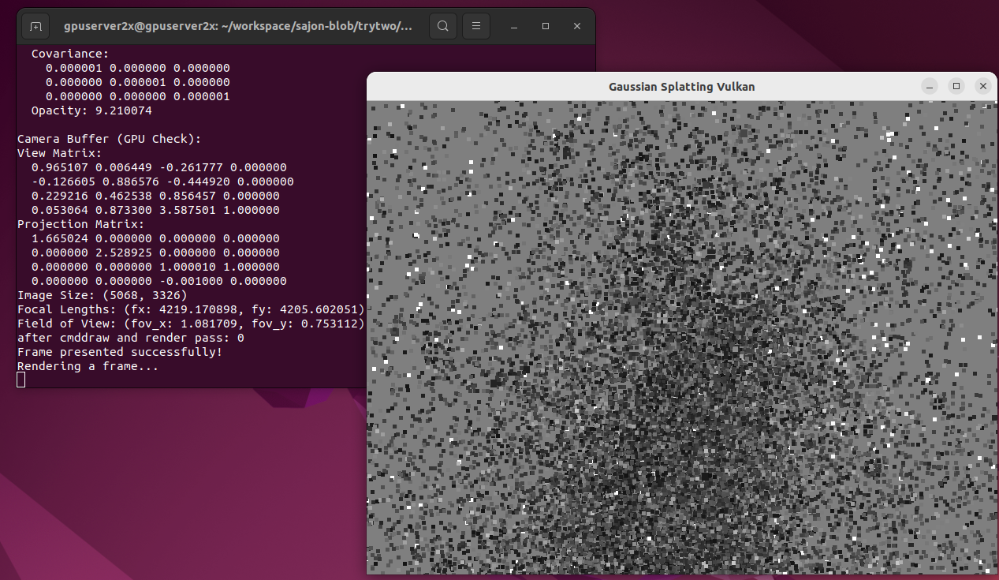

# Vulkan-Based 3D Gaussian Splatting Pipeline

This Vulkan pipeline is designed to rasterize 3D Gaussian points using vertex and fragment shaders, building upon my previous work in writing a barebones 3DGS rendering pipeline from the ground up ([CUDA with Python Bindings](../gaussian_splatting/gaussian_scene.py), [Vulkan Compute Shaders](../vulkan-compute/)). For now, the frustum culling and sorting is done externally.

## Table of Contents
<!-- code_chunk_output -->

- [General Overview of the Pipeline](#general-overview-of-the-pipeline)
  - [1. (External) Frustum Culling & Depth Sorting](#1-external-frustum-culling--depth-sorting)
  - [2. Data Processing in Vulkan & GPU Memory Layout](#2-data-processing-in-vulkan--gpu-memory-layout)
  - [3. Vertex & Fragment Shader Pipeline](#3-vertex--fragment-shader-pipeline)
- [Render Outputs](#render-outputs)
  - [Current Status](#current-status)
  - [Previous Attempts](#previous-attempts)
- [Try It Yourself](#try-it-yourself)
- [To-Dos](#to-dos)

<!-- /code_chunk_output -->

## General Overview of the Pipeline

### **1. (External) Frustum Culling & Depth Sorting** - [Code](./export-data-vulkan.ipynb)

1. Compute the visibility mask & keep only the culled Gaussians
2. Sort Gaussians by Depth (Back-to-Front Order)
3. Convert to a structured binary format to be loaded into GPU buffers in Vulkan

### **2. Data Processing in Vulkan & GPU Memory Layout**

#### **Gaussian Data Representation** 

The Gaussians are stored as structured buffer objects (SSBOs). Each Gaussian structure contains:
- **3D position** (`vec3`) → World-space location of the Gaussian mean.
- **Color** (`vec3`) → RGB color for rendering.
- **3×3 covariance matrix** (`mat3`) → Defines the Gaussian's spread.
- **Opacity** (`float`) → Used for alpha blending.


#### **Camera Data Representation**  

The camera data remains onstant for a given frame. A Uniform Buffer Object (UBO) stores the camera matrices:

- **View Matrix (`mat4`)** → Transforms world-space positions into camera space.
- **Projection Matrix (`mat4`)** → Converts camera-space coordinates into clip space.

### **3. Vertex & Fragment Shader Pipeline**  

#### **Vertex Processing:**

1. Fetch the Gaussian’s position from the SSBO using `gl_VertexIndex`.
2. Convert position to homogeneous coordinates (`vec4` with `w=1.0`).
3. Apply View Matrix → Converts from world space to camera space.
4. Apply Projection Matrix → Converts from camera space to clip space.
5. Pass Gaussian color & opacity to the fragment shader.


#### **Fragment Processing:**

- Takes color and opacity and performs alpha blending
- Vulkan’s fixed-function blending is configured to use `SRC_ALPHA` and `ONE_MINUS_SRC_ALPHA`.


## Render Outputs 

### Current Status 

<!-- (using vertex buffer to handle point geometry from gaussian means, camera view and projection matrices. Gaussians are frustum culled and pre-sorted (back to front). Fragment shader does basic alpha blending on sorted gaussians using color and opacity) -->

*Note: The renders are from first-initialized (untrained) gaussians.*


*Fig 1. Rendering Gaussians using the current rasterization pipeline. Background color set to {{1.0f, 1.0f, 1.0f, 1.0f}} for demonstration purposes.*



*Fig. 2. Reference output from CUDA implementation [notebook](../demo-notebook.ipynb).*


*Fig. 3. Terminal output with debug values*

### Previous Attempts 


*Fig. 4. First try - after getting the framebuffer, swapchain and vertex bindings finally working together!*


*Fig. 5. Added depth buffering*


*Fig. 6. Added color and experimenting with quads*

*Note: Up until this point, I was still using preprocessed ndc coordinates and 2D inverse covariance, hence the incorrect renders.*



*Fig. 7. Fixed camera view, projection and 3D Gaussian input, but without proper Gaussian processing and depth blending*

## Try It Yourself


- Compile the shaders
```
glslc shaders/gaussian.vert -o shaders/gaussian.vert.spv
glslc shaders/gaussian.frag -o shaders/gaussian.frag.spv
```

- Build and run

```
mkdir build && cd build
cmake ..
make
./gaussian_splatting
```


## To-Dos


- Expand the point-based topology. My plan is to estimate a triangle face for each Gaussian component and parameterize the vertices using the barycentric coordinates as outlined in [GaMeS: Mesh-Based Adapting and Modification of Gaussian Splatting](https://arxiv.org/abs/2402.01459). 
- Right now, Gaussians are rendered as simple points. Need to work on Gaussian-based shape approximation using the covariance matrices to properly render anisotropic ellipses.
- Handle the sorting and culling directly in Vulkan


---
*PRs and suggestions are always welcome!*