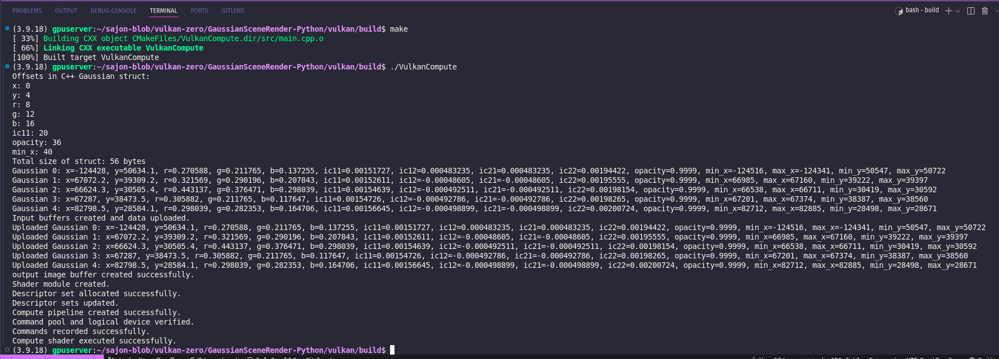

# Vulkan-Based 3D Gaussian Splatting Pipeline 

I have implemented a compute pipeline using Vulkan for 3D Gaussian Splatting (3DGS), building upon my previous work in writing a barebones 3DGS rendering pipeline from the ground up.  The CUDA-based computations [(refer to code)](../cuda/render.cu) have been ported to Vulkan, while the COLMAP data loading and scene preprocessing tasks [(refer to code)](../gaussian_splatting/gaussian_scene.py) remain on the Python side.  The work completed so far includes: 1) setting up the Vulkan environment, 2) loading Gaussian data to input buffers, 3) implementing a compute shader to calculate Gaussian contributions, perform alpha blending, and write to an output buffer, and 4) generating the final output image. This document outlines my high-level understanding of the Vulkan workflow, as well as a technical overview of my implementation. For additional context or rationale behind the Gaussian data and 3DGS pipeline, please refer to the Python and CUDA components in the repository.

Note: Please see [here](../vulkan-rasterization/) for my vertex and fragment-shader based implementation that follows the traditional rasterization pipeline. 

<!-- code_chunk_output -->

## Table of Contents 

  - [1. General Overview of the Vulkan Compute Pipeline](#1-general-overview-of-the-vulkan-compute-pipeline)

  - [2. Overview of the Implementation Steps](#2-overview-of-the-implementation-steps)

  - [3. Pipeline Structure](#3-pipeline-structure)

  - [4. Current Status](#4-current-status)

  - [5. To-Dos](#5-to-dos)

<!-- /code_chunk_output -->

## 1. General Overview of the Vulkan Compute Pipeline

#### 1.1. Vulkan Instance
The Vulkan instance initializes Vulkan and is the base object for all Vulkan operations. I've also enabled validation layers for debugging.

#### 1.2. Physical and Logical Devices
- **Physical Device**: The GPU used for the pipeline.
- **Logical Device**: Interfaces with the GPU and provides access to compute queues for pipeline execution.

#### 1.3. Command Pool and Command Buffers
- **Command Pool**: Allocates and manages command buffers.
- **Command Buffers**: Record commands to dispatch the compute shader.

#### 1.4. Buffers and Memory
Buffers store input data for the compute shader and output data for results.
- Input buffers represent Gaussian data:
    - Position (x, y)
    - Color (r, g, b)
    - Inverse covariance matrix components (ic11, ic12, ic21, ic22)
    - Opacity
    - Bounding box (min_x, max_x, min_y, max_y)
- Output buffer stores the rendered image (RGBA32f format).

Each buffer is created with:
- **VK_BUFFER_USAGE_STORAGE_BUFFER_BIT** for input/output usage in the compute pipeline.
- **VK_MEMORY_PROPERTY_HOST_VISIBLE_BIT** and **VK_MEMORY_PROPERTY_HOST_COHERENT_BIT** for efficient CPU-GPU data transfer.

Data is copied to Vulkan buffers using `vkMapMemory` and `memcpy` to ensure proper synchronization for GPU access.

#### 1.5. Descriptor Sets
Descriptor sets bind Vulkan buffers to the compute shader. Each input/output buffer corresponds to a binding. The descriptor sets are updated using `vkUpdateDescriptorSets` to bind the Gaussian input buffer and the output image buffer to the pipeline.

#### 1.6. Compute Shader
The compute shader performs the splatting (rasterizer) calculation for each pixel and writes results to the output image buffer. The shader is written in GLSL and compiled to SPIR-V using `glslc`.

#### 1.7. Pipeline Layout
Defines how descriptors and push constants are bound to the compute pipeline. Push Constants are used for passing parameters like image dimensions (e.g. height and width).

#### 1.8. Dispatch Call
Executes the compute shader across workgroups based on the image dimensions. Here, workgroup size in the shader matches the dispatch size in `vkCmdDispatch`.


<!-- <div class="no-space">
  <svg height="2" width="100%">
    <line x1="0" y1="0" x2="100%" y2="0" style="stroke:rgb(0,0,0);stroke-width:1" />
  </svg>
</div> -->

## 2. Overview of the Implementation Steps

#### 2.1. Vulkan Setup
- Created a Vulkan instance with validation layers enabled.
- Selected a physical device (GPU) and created a logical device.
- Created a command pool and allocated command buffers.

#### 2.2. Buffers
- Created Vulkan buffers for input data (Gaussian data).
- Created an output buffer for the rendered image.
- Uploaded data to input buffers using host-visible Vulkan memory.

#### 2.3. Descriptor Sets
- Defined descriptor set bindings for the Gaussian input buffer and output buffer.
- Updated the descriptor sets with Vulkan buffer info.

#### 2.4. Integration with COLMAP and Scene Data
- Prepared scene data using existing python code. Saved the processed data to a CSV file containing all inputs for rendering on Vulkan. (Wrote to csv because i needed to explicitly debug the input buffers in early dev phases)
- Implemented a CSV reader to load this data into memory.
- Uploaded the data to Vulkan buffers

#### 2.5. Compute Pipeline
- Wrote compute shader logic for Gaussian Splatting, based on the CUDA implementation
- Compiled the compute shader (GLSL -> SPIR-V).
- Created a compute pipeline with descriptor set layouts and push constants.
- Recorded commands to:
  - Bind the pipeline and descriptor sets.
  - Dispatch the compute shader across the workgroups.

#### 2.6. Output Image
- Implemented output buffer mapping to retrieve rendered data.
- Used STB Image Write to save the buffer contents as a `.png` file for visualization.

<!-- <div style="page-break-after: always;"></div> -->

## 3. Pipeline Structure

#### 3.1. Descriptor Set Layout

My current descriptor set layout is as follows:

| Binding Index | Buffer Description     | Purpose                            |
|---------------|------------------------|------------------------------------|
| 0             | Gaussian Data Buffer   | Stores all Gaussian parameters.    |
| 1             | Output Image Buffer    | Stores the rendered image (RGBA).  |


The `Gaussian` data struct is defined as:
```cpp
struct Gaussian {
    float x, y;                 // Point position
    float r, g, b;              // RGB colors
    float ic11, ic12, ic21, ic22; // Inverse covariance matrix
    float opacity;              // Opacity
    float min_x, max_x, min_y, max_y; // Bounding ranges
};
```

#### 3.2. Push Constants
| Field    | Description                   |
|----------|-------------------------------|
| width    | Width of the output image.    |
| height   | Height of the output image.   |


## 4. Current Status

### 4.1. Rendered Output


*Fig. 1. Its definitely hard to see, but if you look closely you can see the silhouette of the tree trunk. From the structural similarity, I assume the splatting pipeline is functional. I'm currently working to fix this issue.*


*Fig. 2. Reference output from CUDA implementation [notebook](../demo-notebook.ipynb).*




*Fig. 3. Terminal output with debug values.*


### 4.2. Render Time (approx.)
- **Python - Single Threaded**: 18 minutes 36 seconds
- **CUDA - Host Side**: 0.770771 seconds
- **Vulkan - Host Side**: 0.649696 seconds

The Vulkan implementation is faster than the CUDA implementation likely due to the fact that I’m using matrix-vector operations for calculating the Gaussian strength in the compute shader, instead of explicitly calculating each term as in my CUDA implementation.


## 5. To-Dos
- Debug the shader and the output image generation logic.
- Add python bindings 
- Clean up the code. I left a lot of debugging output.
- Implement in a traditional graphics pipeline with vertex and fragment shaders
- (and much more!) 

---
*PRs and suggestions are always welcome!*
